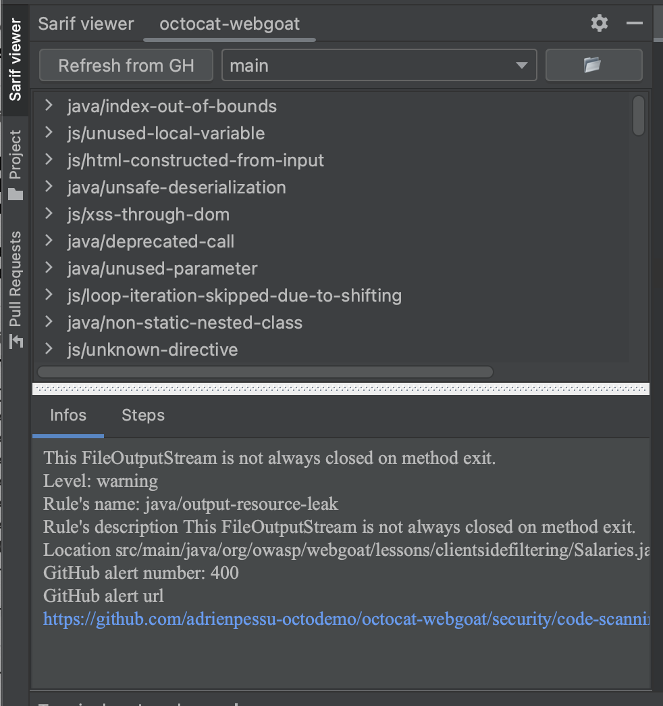
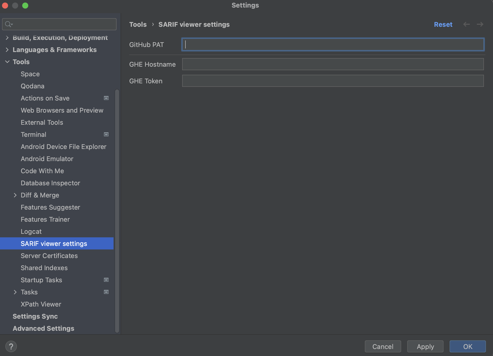

# SARIF-viewer

<!-- Plugin description -->

SARIF viewer to view the results of static analysis tools in the IDE.
The Sarif comes from GitHub Advanced Security (GHAS) or from the local file system.

You must provide in the settings a personal access token (PAT) to access the GitHub API with as least the following scopes:
- Pull request read
- Code scanning read
- Metadata read

<!-- Plugin description end -->

## Installation

### Manual

- Download the signed zip file release from GitHub Releases : https://github.com/adrienpessu/SARIF-viewer/releases
- Add it to you IDE via `Settings > Plugins > Install Plugin from Disk...`

## Configuration

You must provide a personal access token (PAT) to access the GitHub API with as least the following scopes:
- Pull request read
- Code scanning read
- Metadata read

And add it to the plugin configuration via `Settings > Tools > Sarif Viewer`

If you are using GHES, you must also provide the URL and the corresponding token of your GHES instance.

## Usage

If there is a scan done one the current branch, the plugin will automatically display the results in the tool window.

When you change branch, the plugin will automatically display the results of the new branch.
If the current branch has one or more pull request, you will be able to select with the combobox the PR to display the results of.

The result will be grouped by vulnerabilities and you will be able to navigate to the source code by clicking on the result. Also a detail will also be displayed with the path of the vulnerability and the description to help you remediate.

